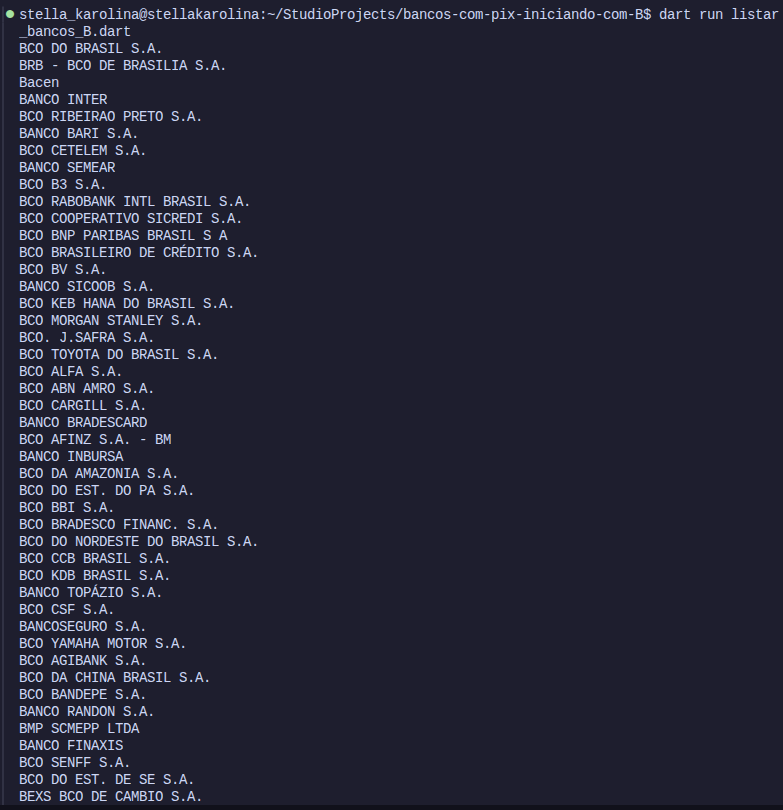

<div align="center">

# Bancos com PIX iniciando com B

### Script em Dart para consultar instituições financeiras na Brasil API e filtrar bancos com nome iniciado pela letra B

<a href="https://github.com/StellaKarolinaNunes/bancos-com-pix-iniciando-com-B">
  
</a>

<br>


<br><br>

<p align="center">
  <a href="https://github.com/StellaKarolinaNunes/bancos-com-pix-iniciando-com-B">
    
  </a>
  <a href="#preview">
    
  </a>
</p>

</div>

---

## Sobre o projeto

O **Bancos com PIX iniciando com B** é um script desenvolvido em **Dart** para consultar informações de instituições financeiras por meio da **Brasil API**.

A aplicação realiza uma requisição HTTP para obter dados bancários atualizados, processa a resposta em formato JSON e aplica filtros para identificar instituições cujo nome inicia com a letra **B** e que atendem aos critérios definidos no código relacionados ao PIX.

O projeto foi desenvolvido com foco em prática de programação assíncrona, consumo de APIs REST, tratamento de respostas JSON, filtragem de dados e exibição de resultados diretamente no terminal.

> Este projeto foi desenvolvido para fins educacionais e de portfólio, com foco em Dart, integração com APIs externas, requisições assíncronas e manipulação de dados JSON.

---

## Objetivo

O objetivo principal é demonstrar como uma aplicação em Dart pode se comunicar com uma API externa, receber dados estruturados e aplicar filtros personalizados.

Em vez de trabalhar com dados estáticos, o script consulta uma fonte externa e processa dinamicamente a lista de instituições financeiras disponíveis.

A atividade reforça conceitos importantes como:

* requisições HTTP;
* programação assíncrona com `Future` e `async/await`;
* tratamento de respostas HTTP;
* manipulação de JSON;
* listas e coleções em Dart;
* filtros condicionais;
* tratamento de erros de conexão;
* saída de dados formatada no terminal.

---

## Funcionalidades

* **Consulta à Brasil API:** busca dados de instituições financeiras disponíveis na API.
* **Requisição HTTP Assíncrona:** utiliza chamadas não bloqueantes para comunicação com o serviço externo.
* **Manipulação de JSON:** processa dados recebidos no formato JSON.
* **Filtro por Inicial:** seleciona instituições cujo nome começa com a letra `B`.
* **Filtro relacionado ao PIX:** identifica bancos que atendem aos critérios definidos pelo projeto para operações com PIX.
* **Exibição no Terminal:** apresenta os resultados de forma organizada no console.
* **Tratamento de Erros:** verifica falhas de conexão e respostas HTTP inválidas.
* **Código Simples e Modular:** estrutura voltada para aprendizado e fácil manutenção.
* **Testes Automatizados:** base preparada para validar filtros e regras de consulta.

---

## Tecnologias utilizadas

| Tecnologia   | Aplicação no projeto                     |
| ------------ | ---------------------------------------- |
| Dart         | Linguagem principal do script            |
| Brasil API   | Fonte externa de dados bancários         |
| HTTP Package | Comunicação com a API REST               |
| JSON         | Estrutura de dados recebida pela API     |
| REST API     | Arquitetura de integração entre sistemas |
| Test Package | Execução de testes automatizados         |
| Git          | Controle de versão                       |
| GitHub       | Hospedagem do repositório                |

---

## Destaques técnicos

* Consumo de API REST externa com Dart;
* Uso de programação assíncrona com `async` e `await`;
* Processamento de listas de dados retornadas em JSON;
* Filtragem de instituições por letra inicial;
* Organização da saída no terminal;
* Tratamento de códigos de resposta HTTP;
* Estrutura preparada para filtros personalizados;
* Base adequada para evolução futura com exportação de dados;
* Projeto simples, útil e focado em prática de Sistemas Distribuídos e integração de serviços.

---

## Fluxo de funcionamento

```text
Início do script
        │
        ▼
Requisição HTTP para a Brasil API
        │
        ▼
Recebimento dos dados bancários em JSON
        │
        ▼
Conversão dos dados para estruturas Dart
        │
        ▼
Aplicação dos filtros
        │
        ├── Nome iniciado com B
        └── Critério relacionado ao PIX
        │
        ▼
Exibição dos bancos encontrados no terminal
```

---

## Preview

<div align="center">



</div>

---

## Estrutura do projeto

```bash
bancos-com-pix-iniciando-com-B/
├── assets/
│   └── images/
│       ├── banner.png
│       └── image.png
│
├── test/
│   └── bancos_test.dart
│
├── listar_bancos_B.dart
├── pubspec.yaml
├── pubspec.lock
├── LICENSE
├── CONTRIBUTING.md
└── README.md
```

> Arquivos e pastas gerados automaticamente pelo Dart, como `.dart_tool/`, não aparecem na estrutura principal porque não devem ser versionados no Git.

---

## Como executar o projeto

### Pré-requisitos

Antes de iniciar, é necessário ter instalado:

* Dart SDK `3.0` ou superior;
* Git;
* Terminal compatível;
* Conexão com a internet para realizar consultas à Brasil API;
* Editor de código com suporte a Dart, como VS Code, Android Studio ou IntelliJ IDEA.

### 1. Clone o repositório

```bash
git clone https://github.com/StellaKarolinaNunes/bancos-com-pix-iniciando-com-B.git
```

### 2. Acesse a pasta do projeto

```bash
cd bancos-com-pix-iniciando-com-B
```

### 3. Verifique a instalação do Dart

```bash
dart --version
```

### 4. Instale as dependências

```bash
dart pub get
```

### 5. Execute o script

```bash
dart run listar_bancos_B.dart
```

---

## Testes

Para executar os testes automatizados do projeto:

```bash
dart test
```

Para analisar possíveis problemas no código:

```bash
dart analyze
```

---

## Roadmap

### Consulta e filtragem de dados

* [x] Integração com a Brasil API;
* [x] Requisição HTTP assíncrona;
* [x] Processamento de dados JSON;
* [x] Filtragem por bancos iniciados com a letra `B`;
* [x] Exibição dos resultados no terminal;
* [x] Tratamento básico de erros de conexão;
* [x] Estrutura inicial de testes;
* [ ] Permitir que o usuário informe qualquer letra para filtrar instituições;
* [ ] Permitir filtragem por nome completo do banco;
* [ ] Adicionar filtros por código bancário;
* [ ] Criar filtros configuráveis via terminal.

### Exportação e visualização

* [ ] Exportar resultados para arquivo `.csv`;
* [ ] Exportar resultados para arquivo `.json`;
* [ ] Criar relatório formatado em texto;
* [ ] Criar tabela organizada para visualização no terminal;
* [ ] Adicionar paginação para listas maiores;
* [ ] Criar histórico local das últimas consultas.

### Evoluções futuras

* [ ] Criar interface gráfica utilizando Flutter;
* [ ] Criar versão web para consulta de bancos;
* [ ] Integrar filtros mais avançados;
* [ ] Criar cache temporário para reduzir requisições;
* [ ] Adicionar GitHub Actions para testes automatizados;
* [ ] Criar documentação detalhada da API utilizada;
* [ ] Criar painel de consulta com múltiplos filtros.

---

## Contribuição

Contribuições são bem-vindas.

```bash
# Faça um fork do projeto

# Crie uma branch para sua funcionalidade
git checkout -b feature/nova-funcionalidade

# Faça suas alterações
git add .

# Crie um commit descritivo
git commit -m "feat: adiciona nova funcionalidade"

# Envie sua branch
git push origin feature/nova-funcionalidade
```

Depois, abra um Pull Request explicando claramente as alterações realizadas.

### Diretrizes

* Mantenha o código organizado e legível;
* Utilize nomes claros para funções, variáveis e filtros;
* Preserve o uso de programação assíncrona para chamadas HTTP;
* Trate erros de conexão e respostas inesperadas da API;
* Adicione testes ao incluir novas regras de filtragem;
* Atualize o README quando houver mudança relevante;
* Evite adicionar arquivos temporários ou gerados automaticamente ao repositório.

---

## Licença

Este projeto está licenciado sob a [Licença MIT](LICENSE).

```text
MIT License

Você pode usar, modificar e distribuir este projeto,
desde que mantenha os créditos e a referência ao repositório original.
```

---

## Créditos

### Desenvolvimento

* **Desenvolvimento principal:** [Stella Karolina Nunes](https://github.com/StellaKarolinaNunes)
* **Desenvolvimento:** [João Gabriel Peres de Castro](https://github.com/Gab0701)

### Tecnologias e recursos

* **Linguagem e SDK:** [Dart](https://dart.dev/)
* **Provedor de dados:** [Brasil API](https://brasilapi.com.br/)
* **Comunicação HTTP:** [http](https://pub.dev/packages/http)
* **Testes:** [test](https://pub.dev/packages/test)
* **Badges:** [Shields.io](https://shields.io/)
* **Controle de versão:** Git e GitHub
